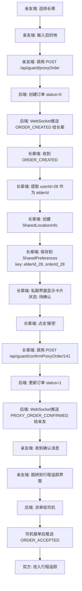
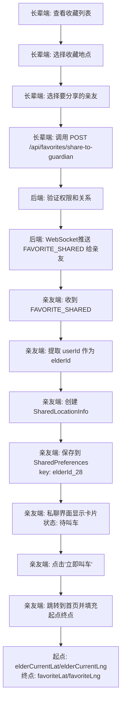
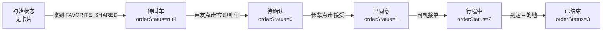

# 代叫车与收藏功能 - 完整技术架构文档

## 📋 目录
1. [核心数据模型](#1-核心数据模型)
2. [API接口清单](#2-api接口清单)
3. [WebSocket推送机制](#3-websocket推送机制)
4. [运行逻辑流程图](#4-运行逻辑流程图)
5. [关键字段说明](#5-关键字段说明)
6. [常见问题排查](#6-常见问题排查)

---

## 1. 核心数据模型

### 1.1 GuardPushMessage (WebSocket推送消息)
**文件**: `app/src/main/java/com/example/myapplication/data/model/WebSocketMessage.kt`

```kotlin
@Serializable
data class GuardPushMessage(
    val type: String,                          // 消息类型（见下方枚举）
    val orderId: Long? = null,                 // 订单ID
    val orderNo: String? = null,               // 订单号
    val destAddress: String? = null,           // 目的地地址
    
    // ⭐ 长辈用户ID字段（优先级从高到低）
    @SerialName("userId")
    val userId: Long? = null,                  // 长辈用户ID（ORDER_CREATED消息中使用）
    
    @SerialName("elderUserId")
    val elderUserId: Long? = null,             // 长辈用户ID（FAVORITE_SHARED消息中使用）
    
    @SerialName("senderId")
    val senderId: Long? = null,                // 发送者ID（聊天消息）
    
    // ⭐ 代叫人信息
    @SerialName("requesterName")
    val proxyUserName: String? = null,         // 代叫人姓名
    
    val proxyUserId: Long? = null,             // 代叫人ID
    
    // ⭐ 聊天消息相关
    val senderType: Int? = null,               // 发送者类型：1-长辈 2-亲友 3-司机
    val messageType: Int? = null,              // 消息类型：1-文字 2-语音 3-快捷短语
    val content: String? = null,               // 消息内容
    
    // ⭐ 收藏地点相关
    val favoriteId: Long? = null,              // 收藏ID
    val favoriteName: String? = null,          // 收藏地点名称
    val favoriteAddress: String? = null,       // 收藏地点地址
    
    @SerialName("favoriteLat")
    val favoriteLatitude: Double? = null,      // 纬度（目的地）
    
    @SerialName("favoriteLng")
    val favoriteLongitude: Double? = null,     // 经度（目的地）
    
    val favoritePhone: String? = null,         // 电话
    val favoriteDescription: String? = null,   // 描述
    
    // ⭐ 长辈实时位置（作为代叫车起点）
    val elderCurrentLat: Double? = null,       // 长辈当前纬度
    val elderCurrentLng: Double? = null,       // 长辈当前经度
    val elderLocationTimestamp: Long? = null,  // 位置更新时间戳
    
    // ⭐ NEW_ORDER 消息专用字段（用于长辈端卡片显示）
    val poiName: String? = null,               // 目的地名称
    val destLat: Double? = null,               // 目的地纬度
    val destLng: Double? = null,               // 目的地经度
    val startLat: Double? = null,              // 起点纬度（长辈位置）
    val startLng: Double? = null,              // 起点经度（长辈位置）
    
    val timestamp: Long = System.currentTimeMillis()  // 时间戳
)
```

### 1.2 SharedLocationInfo (共享位置信息)
**文件**: `app/src/main/java/com/example/myapplication/presentation/chat/ChatViewModel.kt`

```kotlin
data class SharedLocationInfo(
    val elderId: Long,                    // 长辈用户ID
    val elderName: String,                // 长辈姓名
    val favoriteName: String,             // 收藏地点名称
    val favoriteAddress: String,          // 收藏地点地址
    val latitude: Double,                 // 收藏地点纬度（目的地）
    val longitude: Double,                // 收藏地点经度（目的地）
    val timestamp: Long = System.currentTimeMillis(),
    
    // ⭐ 长辈实时位置（作为代叫车起点）
    val elderCurrentLat: Double? = null,   // 长辈当前纬度
    val elderCurrentLng: Double? = null,   // 长辈当前经度
    val elderLocationTimestamp: Long? = null,  // 位置更新时间戳
    
    // ⭐ 订单状态（用于卡片显示）
    val orderId: Long? = null,            // 关联的订单ID
    val orderStatus: Int? = null          // 订单状态：0-待确认 1-已同意 2-行程中 3-已结束
)
```

### 1.3 Order (订单模型)
**文件**: `app/src/main/java/com/example/myapplication/data/model/Order.kt`

```kotlin
@Serializable
data class Order(
    val id: Long,
    val orderNo: String?,
    val status: Int,                      // 订单状态码
    val poiName: String?,                 // 目的地名称
    val destAddress: String?,             // 目的地地址
    val destLat: Double?,                 // 目的地纬度
    val destLng: Double?,                 // 目的地经度
    val estimatePrice: Double?,           // 预估价格
    val createTime: String?,              // 创建时间
    val driverPhone: String?,             // 司机电话
    val elderId: Long?,                   // 长辈ID（代叫车时）
    val guardianId: Long?,                // 亲友ID（代叫车时）
    val startLat: Double?,                // 起点纬度
    val startLng: Double?                 // 起点经度
) {
    fun getStatusText(): String {
        return when (status) {
            0 -> "待确认"
            1 -> "已确认"
            2 -> "等待司机接单"
            3 -> "司机已接单"
            4 -> "司机已到达"
            5 -> "行程中"
            6 -> "已完成"
            7 -> "已取消"
            8 -> "已拒绝"
            else -> "未知状态"
        }
    }
}
```

---

## 2. API接口清单

### 2.1 亲情守护相关接口

#### 2.1.1 代叫车（亲友操作）
- **路径**: `POST /api/guard/proxyOrder`
- **Header**: `X-User-Id: {亲友ID}`
- **请求体**:
```json
{
  "elderId": 28,
  "destAddress": "广东省潮州市湘桥区木棉酒店",
  "destLat": 23.655876083140846,
  "destLng": 116.6705916234186,
  "startLat": 23.6557241112633,
  "startLng": 116.67212612973297,
  "passengerCount": 1,
  "remark": "帮妈妈叫车"
}
```
- **响应**:
```json
{
  "code": 200,
  "message": "success",
  "data": {
    "orderId": 141,
    "orderNo": "AX177671270129411951000",
    "status": 0
  }
}
```

#### 2.1.2 长辈确认代叫车
- **路径**: `POST /api/guard/confirmProxyOrder/{orderId}`
- **Header**: `X-User-Id: {长辈ID}`
- **请求体**:
```json
{
  "confirmed": true
}
```
- **响应**:
```json
{
  "code": 200,
  "message": "success",
  "data": {
    "orderId": 141,
    "confirmTime": "2026-04-21T03:18:27.644455700"
  }
}
```

#### 2.1.3 查询代叫订单列表
- **路径**: `GET /api/guard/proxyOrders`
- **Header**: `X-User-Id: {亲友ID}`
- **响应**:
```json
{
  "code": 200,
  "data": [
    {
      "id": 141,
      "orderNo": "AX177671270129411951000",
      "status": 1,
      "poiName": "木棉酒店",
      "createTime": "2026-04-21T03:18:21.297052500"
    }
  ]
}
```

#### 2.1.4 获取我的长辈列表（亲友操作）
- **路径**: `GET /api/guard/myElders`
- **Header**: `X-User-Id: {亲友ID}`
- **响应**:
```json
{
  "code": 200,
  "data": [
    {
      "elderId": 28,
      "elderName": "张三",
      "relationship": "父亲",
      "bindTime": "2026-04-15T10:00:00"
    }
  ]
}
```

#### 2.1.5 获取我的亲友列表（长辈操作）
- **路径**: `GET /api/guard/myGuardians`
- **Header**: `X-User-Id: {长辈ID}`
- **响应**:
```json
{
  "code": 200,
  "data": [
    {
      "guardianId": 27,
      "guardianName": "李四",
      "relationship": "儿子",
      "phone": "13800138000"
    }
  ]
}
```

### 2.2 收藏功能相关接口

#### 2.2.1 获取收藏列表
- **路径**: `GET /api/favorites`
- **Header**: `Authorization: Bearer {token}`
- **响应**:
```json
{
  "code": 200,
  "data": [
    {
      "id": 1,
      "name": "家",
      "address": "广东省潮州市湘桥区XX路XX号",
      "latitude": 23.656,
      "longitude": 116.622,
      "type": "HOME",
      "updatedAt": "2026-04-17T10:00:00"
    }
  ]
}
```

#### 2.2.2 添加收藏
- **路径**: `POST /api/favorites`
- **Header**: `Authorization: Bearer {token}`
- **Content-Type**: `application/json`
- **请求体**:
```json
{
  "name": "市人民医院",
  "address": "广东省潮州市XX区XX大道",
  "latitude": 23.660,
  "longitude": 116.630,
  "type": "HOSPITAL",
  "phone": "0768-1234567",
  "description": "三甲医院，有急诊科"
}
```

#### 2.2.3 分享收藏地点给亲友
- **路径**: `POST /api/favorites/share-to-guardian`
- **Header**: `Authorization: Bearer {token}`
- **Content-Type**: `application/x-www-form-urlencoded`
- **请求参数**:
  - `favoriteId`: 收藏ID
  - `guardianUserId`: 亲友用户ID
- **响应**:
```json
{
  "code": 200,
  "message": "分享成功"
}
```
- **后端行为**: 通过 WebSocket 向亲友推送 `FAVORITE_SHARED` 消息

#### 2.2.4 确认到达目的地
- **路径**: `POST /api/favorites/confirm-arrival-simple`
- **Header**: `Authorization: Bearer {token}`
- **Content-Type**: `application/x-www-form-urlencoded`
- **请求参数**:
  - `favoriteId`: 收藏ID
  - `orderId`: 订单ID（可选）
- **响应**:
```json
{
  "code": 200,
  "message": "确认到达成功"
}
```
- **后端行为**: 
  1. 更新订单状态为"已完成"（status=6）
  2. 在 `travel_records` 表创建出行记录
  3. 通过 WebSocket 向所有亲友推送 `ARRIVAL_CONFIRMED` 消息

---

## 3. WebSocket推送机制

### 3.1 消息类型枚举

| 消息类型 | 触发场景 | 接收方 | 说明 |
|---------|---------|-------|------|
| `ORDER_CREATED` | 亲友创建代叫车订单 | 长辈端 | 通知长辈有新的代叫车请求 |
| `PROXY_ORDER_CONFIRMED` | 长辈确认代叫车 | 亲友端 | 通知亲友长辈已同意 |
| `FAVORITE_SHARED` | 长辈分享收藏地点 | 亲友端 | 通知亲友长辈分享了地点 |
| `ARRIVAL_CONFIRMED` | 长辈确认到达 | 亲友端 | 通知亲友长辈已到达目的地 |
| `CHAT_MESSAGE` | 订单内聊天消息 | 订单参与者 | 实时聊天消息推送 |

### 3.2 ORDER_CREATED 消息结构

**⚠️ 重要说明**：后端推送的消息有两种格式，前端需要兼容处理。

#### 格式1：直接类型（推荐）
当 WebSocket 消息的顶层 `type` 字段就是 `ORDER_CREATED` 时：

```json
{
  "type": "ORDER_CREATED",
  "message": "您的亲友亲友为您叫了一辆车",
  "success": true,
  "data": {
    "userId": 28,                        // ⭐ 长辈用户ID（关键字段）
    "guardianUserId": 27,                // 亲友用户ID
    "orderId": 141,
    "orderNo": "AX177671270129411951000",
    "requesterName": "亲友",             // ⭐ 映射到 proxyUserName
    "destAddress": "广东省潮州市湘桥区桥东街道木棉酒店(韩师店)",
    "poiName": "广东省潮州市湘桥区桥东街道木棉酒店(韩师店)",
    "destLat": 23.655876083140846,
    "destLng": 116.6705916234186,
    "startLat": 23.6557241112633,        // 长辈当前位置（起点）
    "startLng": 116.67212612973297,
    "estimatePrice": 0.0,
    "status": 0,                         // 0-待确认
    "createTime": "2026-04-21T03:18:21.297052500"
  }
}
```

**前端处理逻辑**：
1. 检测到顶层 `type == "ORDER_CREATED"`
2. 提取 `data` 对象并合并到根节点
3. 使用 `@SerialName` 注解映射字段：
   - `requesterName` → `proxyUserName`
   - `userId` → `userId`（新增字段）
4. 从 `pushMessage.userId` 获取长辈ID（优先级最高）

#### 格式2：GUARD_PUSH 包装类型（旧版）
当 WebSocket 消息的顶层 `type` 是 `GUARD_PUSH` 时：

```json
{
  "type": "GUARD_PUSH",
  "data": {
    "type": "ORDER_CREATED",
    "userId": 28,
    "guardianUserId": 27,
    "orderId": 141,
    "requesterName": "亲友",
    "destAddress": "...",
    ...
  }
}
```

**前端处理逻辑**：
1. 检测到顶层 `type == "GUARD_PUSH"`
2. 提取内层 `data.type` 判断具体消息类型
3. 将内层 `data` 对象合并到根节点进行解析

### 3.3 FAVORITE_SHARED 消息结构

**后端发送给亲友端的 JSON**:

#### 格式1：直接类型（推荐）
```json
{
  "type": "FAVORITE_SHARED",
  "userId": 28,                        // ⭐ 长辈用户ID（优先使用）
  "elderUserId": 28,                   // 兼容字段
  "senderId": 28,                      // 兼容字段
  "proxyUserName": "张阿姨",            // 长辈姓名
  "favoriteName": "人民公园",
  "favoriteAddress": "北京市朝阳区xxx",
  "favoriteLatitude": 39.9042,         // 收藏地点坐标（目的地）
  "favoriteLongitude": 116.4074,
  "elderCurrentLat": 39.9150,          // ⭐ 长辈实时位置（起点）
  "elderCurrentLng": 116.4040,
  "elderLocationTimestamp": 1713600000000
}
```

#### 格式2：GUARD_PUSH 包装类型
```json
{
  "type": "GUARD_PUSH",
  "data": {
    "type": "FAVORITE_SHARED",
    "userId": 28,
    "elderUserId": 28,
    "proxyUserName": "张阿姨",
    "favoriteName": "人民公园",
    "favoriteAddress": "北京市朝阳区xxx",
    "favoriteLatitude": 39.9042,
    "favoriteLongitude": 116.4074,
    "elderCurrentLat": 39.9150,
    "elderCurrentLng": 116.4040,
    "elderLocationTimestamp": 1713600000000
  }
}
```

**前端处理逻辑**：
1. 优先从 `pushMessage.userId` 获取长辈ID
2. 如果为空，降级到 `pushMessage.elderUserId`
3. 再降级到 `pushMessage.senderId`
4. 最终降级到 `tokenManager.getUserId()`

### 3.4 PROXY_ORDER_CONFIRMED 消息结构

**后端发送给亲友端的 JSON**:

#### 格式1：直接类型（推荐）
```json
{
  "type": "PROXY_ORDER_CONFIRMED",
  "userId": 28,                        // ⭐ 长辈用户ID（新增字段）
  "orderId": 141,
  "confirmed": true,
  "elderUserId": 28,                   // 兼容字段
  "confirmTime": "2026-04-21T03:18:27.644455700"
}
```

#### 格式2：无 data 字段（当前实际格式）
```json
{
  "orderId": 141,
  "confirmTime": "2026-04-21T03:18:27.644455700",
  "type": "PROXY_ORDER_CONFIRMED",
  "confirmed": true,
  "elderUserId": 28
}
```

**注意**：当前后端返回的是格式2，没有 `userId` 字段，只有 `elderUserId`。
前端需要从 `elderUserId` 或 `tokenManager.getUserId()` 获取长辈ID。

**前端处理逻辑**：
```kotlin
// PROXY_ORDER_CONFIRMED 消息中没有 userId 字段
val elderId = pushMessage.userId ?: pushMessage.elderUserId ?: MyApplication.tokenManager.getUserId() ?: 0L
```

---

## 4. 运行逻辑流程图

### 4.1 代叫车完整流程



### 4.2 收藏分享流程



### 4.3 卡片状态流转



---

## 5. 关键字段说明

### 5.1 用户ID字段优先级

在不同类型的 WebSocket 消息中，长辈用户ID的字段名不同：

| 消息类型 | 优先字段 | 备选字段1 | 备选字段2 | 最终备选 |
|---------|---------|----------|----------|----------|
| `ORDER_CREATED` | `data.userId` | - | - | `tokenManager.getUserId()` |
| `FAVORITE_SHARED` | `userId` | `elderUserId` | `senderId` | `tokenManager.getUserId()` |
| `PROXY_ORDER_CONFIRMED` | `userId` | `elderUserId` | - | `tokenManager.getUserId()` |

**⚠️ 重要发现**：
- `ORDER_CREATED` 消息中，后端返回的是 `data.userId`（在 data 对象内部）
- `FAVORITE_SHARED` 消息中，后端应该返回顶层 `userId` 字段
- `PROXY_ORDER_CONFIRMED` 消息中，当前后端只返回 `elderUserId`，**没有 `userId` 字段**

**代码示例**:
```kotlin
// ORDER_CREATED 处理（从 data 中提取）
val elderId = pushMessage.userId ?: MyApplication.tokenManager.getUserId() ?: 0L

// FAVORITE_SHARED 处理（多层降级）
val elderId = pushMessage.userId ?: pushMessage.elderUserId ?: pushMessage.senderId ?: 0L

// PROXY_ORDER_CONFIRMED 处理（当前只有 elderUserId）
val elderId = pushMessage.userId ?: pushMessage.elderUserId ?: MyApplication.tokenManager.getUserId() ?: 0L
```

**🔴 给后端的建议**：
为了统一前端处理逻辑，建议所有 WebSocket 推送消息都包含顶层 `userId` 字段：
```json
{
  "type": "PROXY_ORDER_CONFIRMED",
  "userId": 28,              // ⭐ 新增：统一字段
  "elderUserId": 28,         // 保留兼容
  "orderId": 141,
  ...
}
```

### 5.2 SharedPreferences 持久化 Key 规则

所有 key 都使用 `{field}_${elderId}` 格式：

```kotlin
// 保存
prefs.edit()
    .putLong("elderId_${elderId}", elderId)
    .putString("elderName_${elderId}", elderName)
    .putString("favoriteName_${elderId}", favoriteName)
    .putString("favoriteAddress_${elderId}", favoriteAddress)
    .putFloat("latitude_${elderId}", latitude.toFloat())
    .putFloat("longitude_${elderId}", longitude.toFloat())
    .putFloat("elderCurrentLat_${elderId}", elderCurrentLat?.toFloat() ?: 0f)
    .putFloat("elderCurrentLng_${elderId}", elderCurrentLng?.toFloat() ?: 0f)
    .putLong("elderLocationTimestamp_${elderId}", elderLocationTimestamp ?: 0L)
    .putLong("orderId_${elderId}", orderId ?: 0L)
    .apply()

// 恢复
val cachedElderId = prefs.getLong("elderId_${userId}", -1L)
if (cachedElderId == userId) {
    // 恢复成功
}
```

### 5.3 订单状态码对照表

| 状态码 | 含义 | 前端显示 | 备注 |
|-------|------|---------|------|
| 0 | 待确认 | "⏳ 等待长辈确认..." | 亲友创建订单后 |
| 1 | 已确认 | "✅ 已确认，正在寻找司机" | 长辈点击接受后 |
| 2 | 等待司机接单 | "🚕 正在为您寻找司机..." | 系统派单中 |
| 3 | 司机已接单 | "🚗 司机已接单 - 赶来中" | 司机接受订单 |
| 4 | 司机已到达 | "🚖 司机已到达上车点" | 司机到达起点 |
| 5 | 行程中 | "🚙 行程中 - 前往目的地" | 乘客已上车 |
| 6 | 已完成 | "✅ 行程已结束" | 到达目的地 |
| 7 | 已取消 | "❌ 订单已取消" | 用户或系统取消 |
| 8 | 已拒绝 | "❌ 长辈已拒绝" | 长辈点击拒绝 |

---

## 6. 常见问题排查

### 6.1 elderId=0 问题

**症状**:
- 日志显示: `elderId=0`, `未找到匹配的 sharedLocation`
- SharedPreferences key 都是 `_0` 后缀
- 点击"接受"时传递 `orderId=0`

**原因**:
- 后端返回的是 `userId` 字段，但代码尝试从 `elderUserId` 或 `proxyUserId` 获取
- 这两个字段都为 null，导致降级到默认值 0

**解决方案**:
```kotlin
// ✅ 正确做法
val elderId = pushMessage.userId ?: MyApplication.tokenManager.getUserId() ?: 0L

// ❌ 错误做法
val elderId = pushMessage.elderUserId ?: pushMessage.proxyUserId ?: 0L
```

### 6.2 卡片不显示问题

**检查清单**:
1. ✅ `ChatViewModel.sharedLocation.value != null`
2. ✅ SharedPreferences 中有对应的缓存数据
3. ✅ `elderId` 正确匹配（不是 0）
4. ✅ 私聊界面的 `targetUserId` 等于 `sharedLocation.elderId`

**调试日志**:
```kotlin
Log.d("PrivateChatScreen", "🎴 [卡片状态] sharedLocation.value != null: ${sharedLocation != null}")
Log.d("PrivateChatScreen", "🎴 [卡片数据] elderId=${sharedLocation?.elderId}, targetUserId=$targetUserId")
```

### 6.3 无限循环请求代打车

**症状**:
- 反复收到 `ORDER_CREATED` 消息
- 每次都会创建新的 `SharedLocationInfo`

**原因**:
- `elderId=0` 导致无法正确匹配已有的 `sharedLocation`
- 每次都认为没有缓存，重新创建

**解决方案**:
- 修复 `elderId` 提取逻辑（见 6.1）
- 确保后端只推送一次 `ORDER_CREATED`

### 6.4 点击"接受"后没有反应

**检查清单**:
1. ✅ `orderId` 不为 0
2. ✅ 网络请求成功（查看 Logcat 中的 HTTP 日志）
3. ✅ WebSocket 连接正常
4. ✅ 后端返回正确的响应

**调试步骤**:
```kotlin
// 1. 检查 orderId
Log.d("ChatViewModel", "🔍 [调试] pendingOrderId 的值: $pendingOrderId")

// 2. 检查 API 调用
Log.d("ChatViewModel", "📱 长辈确认代叫车：orderId=$orderId, confirmed=true")

// 3. 检查响应
Log.d("ChatViewModel", "✅ [全局] 长辈接受代叫车：orderId=$orderId")
```

### 6.5 起点位置不正确

**症状**:
- 代叫车的起点不是长辈当前位置
- 使用了默认位置或当前位置

**原因**:
- 后端推送的 `FAVORITE_SHARED` 消息中没有包含 `elderCurrentLat/elderCurrentLng`
- 或者位置已过期（超过 5 分钟）

**解决方案**:
1. 确保后端在推送时包含长辈实时位置
2. 前端优先使用 `elderCurrentLat/elderCurrentLng`
3. 如果为空或过期，降级使用当前位置

**代码示例**:
```kotlin
val startLat = sharedLocation.elderCurrentLat ?: currentLocation?.latitude
val startLng = sharedLocation.elderCurrentLng ?: currentLocation?.longitude

if (sharedLocation.elderCurrentLat == null) {
    Log.w("HomeViewModel", "⚠️ 未收到长辈实时位置，使用当前位置作为起点")
}
```

---

## 🔴 后端核实清单（重要）

### A. WebSocket 推送消息字段统一性

#### A.1 ORDER_CREATED 消息
**当前状态**: ✅ 已验证，包含 `userId` 字段

**需要确认**:
```json
{
  "type": "ORDER_CREATED",
  "data": {
    "userId": 28,                    // ✅ 必须有
    "guardianUserId": 27,            // ✅ 必须有
    "orderId": 141,                  // ✅ 必须有
    "requesterName": "亲友",         // ✅ 必须有（前端映射到 proxyUserName）
    "destAddress": "...",            // ✅ 必须有
    "poiName": "...",                // ✅ 必须有
    "destLat": 23.655876083140846,   // ✅ 必须有
    "destLng": 116.6705916234186,    // ✅ 必须有
    "startLat": 23.6557241112633,    // ✅ 必须有（长辈当前位置）
    "startLng": 116.67212612973297   // ✅ 必须有（长辈当前位置）
  }
}
```

#### A.2 FAVORITE_SHARED 消息
**当前状态**: ⚠️ 需要后端确认是否包含 `userId` 字段

**期望格式**:
```json
{
  "type": "FAVORITE_SHARED",
  "userId": 28,                      // 🔴 请确认是否有此字段
  "elderUserId": 28,                 // ✅ 兼容字段
  "senderId": 28,                    // ✅ 兼容字段
  "proxyUserName": "张阿姨",          // ✅ 必须有
  "favoriteName": "人民公园",        // ✅ 必须有
  "favoriteAddress": "...",          // ✅ 必须有
  "favoriteLatitude": 39.9042,       // ✅ 必须有
  "favoriteLongitude": 116.4074,     // ✅ 必须有
  "elderCurrentLat": 39.9150,        // 🔴 请确认是否有此字段（长辈实时位置）
  "elderCurrentLng": 116.4040,       // 🔴 请确认是否有此字段
  "elderLocationTimestamp": 1713600000000  // 🔴 请确认是否有此字段
}
```

**❓ 待确认问题**:
1. 是否返回顶层 `userId` 字段？
2. 是否返回 `elderCurrentLat/elderCurrentLng`（长辈实时位置）？
3. 如果长辈位置为空，是返回 `null` 还是不返回该字段？

#### A.3 PROXY_ORDER_CONFIRMED 消息
**当前状态**: ❌ **缺少 `userId` 字段**

**实际返回**（从日志第55行）:
```json
{
  "orderId": 141,
  "confirmTime": "2026-04-21T02:56:32.009187",
  "type": "PROXY_ORDER_CONFIRMED",
  "confirmed": true,
  "elderUserId": 28
}
```

**期望格式**:
```json
{
  "userId": 28,                      // 🔴 请新增此字段
  "elderUserId": 28,                 // ✅ 保留兼容
  "orderId": 141,
  "confirmed": true,
  "confirmTime": "2026-04-21T02:56:32.009187"
}
```

**🔴 后端需要修改**:
在 `PROXY_ORDER_CONFIRMED` 消息中添加 `userId` 字段，值等于 `elderUserId`。

---

### B. API 接口响应格式

#### B.1 代叫车接口 POST /api/guard/proxyOrder
**当前状态**: ✅ 已验证，返回正确

**响应示例**（从日志第12行）:
```json
{
  "code": 200,
  "message": "success",
  "data": {
    "id": 137.0,                     // ⚠️ 注意：后端返回的是浮点数
    "orderNo": "AX177671138891984761000",
    "userId": 28.0,                  // 长辈ID
    "proxyUserId": 27.0,             // 亲友ID
    "elderUserId": 28.0,             // 长辈ID（冗余字段）
    "status": 0.0,                   // ⚠️ 注意：后端返回的是浮点数
    ...
  }
}
```

**⚠️ 注意事项**:
- 后端返回的数字都是浮点数（如 `137.0`），前端使用 `Long?` 接收时会自动转换
- 建议后端改为返回整数类型（如 `137`），避免精度问题

#### B.2 长辈确认接口 POST /api/guard/confirmProxyOrder/{orderId}
**当前状态**: ✅ 已验证，返回正确

**请求参数**:
- Path: `orderId` (Long)
- Header: `X-User-Id: 28`
- Body: `{"confirmed": true}`

**响应示例**:
```json
{
  "code": 200,
  "message": "success",
  "data": {
    "orderId": 141,
    "confirmTime": "2026-04-21T02:56:32.009187"
  }
}
```

---

### C. WebSocket 消息推送时机

#### C.1 ORDER_CREATED
**触发时机**: 亲友调用 `POST /api/guard/proxyOrder` 成功后
**推送对象**: 长辈端（`userId = elderId`）
**推送内容**: 包含完整的订单信息和起点终点坐标

#### C.2 PROXY_ORDER_CONFIRMED
**触发时机**: 长辈调用 `POST /api/guard/confirmProxyOrder/{orderId}` 成功后
**推送对象**: 亲友端（`userId = guardianUserId`）
**推送内容**: 订单ID、确认时间、长辈ID

#### C.3 FAVORITE_SHARED
**触发时机**: 长辈调用 `POST /api/favorites/share-to-guardian` 成功后
**推送对象**: 指定的亲友端（`userId = guardianUserId`）
**推送内容**: 收藏地点信息 + 长辈实时位置

---

### D. 关键字段命名规范

| 前端字段名 | 后端字段名 | 说明 |
|----------|----------|------|
| `proxyUserName` | `requesterName` | 代叫人姓名（使用 `@SerialName` 映射） |
| `userId` | `userId` | 长辈用户ID（统一字段） |
| `elderUserId` | `elderUserId` | 长辈用户ID（兼容字段） |
| `guardianUserId` | `guardianUserId` | 亲友用户ID |
| `favoriteLatitude` | `favoriteLat` | 收藏地点纬度（使用 `@SerialName` 映射） |
| `favoriteLongitude` | `favoriteLng` | 收藏地点经度（使用 `@SerialName` 映射） |

**🔴 后端建议**:
为了减少前端的字段映射复杂度，建议后端统一使用以下字段名：
- `requesterName` → 改为 `proxyUserName`
- `favoriteLat` → 改为 `favoriteLatitude`
- `favoriteLng` → 改为 `favoriteLongitude`

或者保持现状，前端继续使用 `@SerialName` 注解进行映射。

---

### E. 已知问题与修复建议

#### E.1 问题：PROXY_ORDER_CONFIRMED 缺少 userId 字段
**影响**: 前端无法直接从消息中获取长辈ID，需要降级到 `elderUserId` 或 `tokenManager.getUserId()`

**修复方案**:
```java
// 后端代码示例
Map<String, Object> data = new HashMap<>();
data.put("userId", order.getElderUserId());      // ⭐ 新增
data.put("elderUserId", order.getElderUserId()); // 保留
data.put("orderId", order.getId());
data.put("confirmed", true);
data.put("confirmTime", LocalDateTime.now());
```

#### E.2 问题：数字类型不一致
**影响**: 后端返回浮点数（`137.0`），前端期望整数（`137`）

**修复方案**:
```java
// 后端代码示例
Map<String, Object> data = new HashMap<>();
data.put("id", order.getId().longValue());           // 改为 Long
data.put("userId", order.getUserId().longValue());   // 改为 Long
data.put("status", order.getStatus().intValue());    // 改为 Integer
```

#### E.3 问题：FAVORITE_SHARED 可能缺少长辈实时位置
**影响**: 前端无法获取长辈当前位置作为代叫车起点

**修复方案**:
```java
// 后端代码示例
Map<String, Object> data = new HashMap<>();
data.put("userId", elder.getId());
data.put("favoriteName", favorite.getName());
// ⭐ 新增：长辈实时位置
data.put("elderCurrentLat", elder.getCurrentLat());
data.put("elderCurrentLng", elder.getCurrentLng());
data.put("elderLocationTimestamp", System.currentTimeMillis());
```

---

## 📝 附录

### A. 相关文件清单

#### 数据模型
- `app/src/main/java/com/example/myapplication/data/model/WebSocketMessage.kt`
- `app/src/main/java/com/example/myapplication/data/model/Order.kt`
- `app/src/main/java/com/example/myapplication/data/model/FavoriteLocation.kt`

#### ViewModel
- `app/src/main/java/com/example/myapplication/presentation/chat/ChatViewModel.kt`
- `app/src/main/java/com/example/myapplication/presentation/home/HomeViewModel.kt`
- `app/src/main/java/com/example/myapplication/presentation/favorites/FavoritesViewModel.kt`

#### UI 组件
- `app/src/main/java/com/example/myapplication/presentation/chat/PrivateChatScreen.kt`
- `app/src/main/java/com/example/myapplication/presentation/favorites/ElderFavoritesScreen.kt`

#### 网络层
- `app/src/main/java/com/example/myapplication/core/network/ApiService.kt`
- `app/src/main/java/com/example/myapplication/data/repository/FavoritesRepository.kt`

#### 全局管理
- `app/src/main/java/com/example/myapplication/MyApplication.kt`

### B. 关键日志关键词

搜索这些关键词可以快速定位问题：
- `elderId=` - 检查长辈ID是否正确
- `sharedLocation` - 检查共享位置状态
- `ORDER_CREATED` - 检查订单创建消息
- `FAVORITE_SHARED` - 检查收藏分享消息
- `SharedPreferences` - 检查持久化存储
- `orderId=` - 检查订单ID

### C. 版本历史

| 版本 | 日期 | 修改内容 |
|-----|------|---------|
| v1.0 | 2026-04-21 | 初始版本，修复 elderId=0 问题 |

---

**文档维护者**: AI Assistant  
**最后更新**: 2026-04-21  
**适用项目**: MyApplication (Android 亲情守护打车应用)
