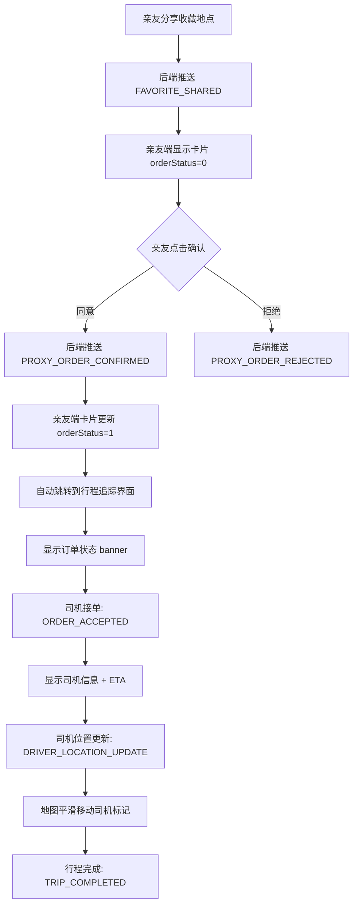

# 卡片显示与行程追踪界面 - 后端API对接说明

**文档版本**: v2.0（已根据实际实现更新）  
**生成时间**: 2026-04-21  
**优先级**: 🔴 高（影响代叫车功能用户体验）

---

## 📋 概述

本文档详细说明前端**卡片显示**和**行程追踪界面**所需的后端WebSocket推送消息格式。

**⚠️ 重要说明**：后端实际采用**扁平结构**而非嵌套结构，所有字段直接在根层级，且所有消息类型都已添加顶层 `userId` 字段。

---

## 🎯 核心功能流程



---

## 📱 一、卡片显示功能（两个端口）

### 1.1 卡片展示位置

#### 长辈端（ElderSimplifiedScreen.kt）
- **位置**: 首页底部面板
- **触发条件**: 收到 `ORDER_CREATED` WebSocket 消息
- **显示内容**: 
  - 目的地名称
  - 司机信息（如果有）
  - 操作按钮：呼叫司机、聊天

#### 普通用户端（PrivateChatScreen.kt）
- **位置**: 与长辈的私聊界面
- **触发条件**: 收到 `FAVORITE_SHARED` WebSocket 消息
- **显示内容**:
  - 分享的地点名称
  - 起点/终点地址
  - **订单状态提示卡片**（根据 orderStatus 动态变化）
  - 操作按钮（根据 orderStatus 动态变化）

---

### 1.2 卡片状态流转（普通用户端）⭐ 最关键

#### 状态 0：待确认（orderStatus = 0）

**触发场景**: 长辈分享收藏地点给亲友

**WebSocket 消息格式**（✅ 扁平结构）:
```json
{
  "type": "FAVORITE_SHARED",
  "userId": 27,                    // ⭐ 接收者ID（亲友）
  "elderUserId": 28,               // 长辈ID
  "proxyUserName": "张阿姨",       // 长辈姓名
  "favoriteName": "人民公园",
  "favoriteAddress": "北京市朝阳区xxx",
  "favoriteLatitude": 39.9042,
  "favoriteLongitude": 116.4074,
  
  // ⭐ 新增：长辈实时位置（作为代叫车起点）
  "elderCurrentLat": 39.9150,
  "elderCurrentLng": 116.4040,
  "elderLocationTimestamp": 1713600000000,
  
  // ⭐ 新增：订单相关信息（如果有）
  "orderId": 141,                  // 订单ID（如果已创建订单）
  "orderStatus": 0                 // 订单状态：0-待确认
}
```

**UI 显示**:
```
┌─────────────────────────────────────┐
│ 📍 分享的地点                        │
│                                     │
│ 人民公园                             │
│                                     │
│ 🟢 起点：长辈当前位置               │
│ 🔴 终点：人民公园                   │
│                                     │
│ ┌─────────────────────────────────┐ │
│ │ 🔔 张阿姨 请求您帮她代叫车      │ │
│ └─────────────────────────────────┘ │
│                                     │
│ [✅ 同意]  [❌ 拒绝]               │
└─────────────────────────────────────┘
```

**操作按钮**:
- ✅ **同意**: 调用 API `/api/guard/confirmProxyOrder/{orderId}`，传参 `{ "accepted": true }`
- ❌ **拒绝**: 调用 API `/api/guard/confirmProxyOrder/{orderId}`，传参 `{ "accepted": false }`

---

#### 状态 1：已同意（orderStatus = 1）

**触发场景**: 亲友点击"同意"按钮后，后端推送确认消息

**WebSocket 消息格式**（✅ 扁平结构）:
```json
{
  "type": "PROXY_ORDER_CONFIRMED",
  "userId": 27,                    // ⭐ 接收者ID（亲友）
  "orderId": 141,
  "confirmed": true,               // true=同意, false=拒绝
  "elderUserId": 28,               // ⭐ 长辈ID（用于更新卡片）
  "confirmTime": "2026-04-21T02:56:32.009187"
}
```

**UI 显示**:
```
┌─────────────────────────────────────┐
│ 📍 分享的地点                        │
│                                     │
│ 人民公园                             │
│                                     │
│ 🟢 起点：长辈当前位置               │
│ 🔴 终点：人民公园                   │
│                                     │
│ ┌─────────────────────────────────┐ │
│ │ ✅ 您已同意代叫车请求           │ │
│ └─────────────────────────────────┘ │
│                                     │
│ （无操作按钮，自动跳转行程追踪）     │
└─────────────────────────────────────┘
```

**前端行为**:
1. 更新卡片状态为 `orderStatus = 1`
2. 延迟 500ms 后自动跳转到行程追踪界面
3. 导航路径: `order_tracking/{orderId}`

---

#### 状态 2：行程中（orderStatus = 2）

**触发场景**: 司机接单后，后端推送订单状态更新

**WebSocket 消息格式**（✅ 扁平结构）:
```json
{
  "type": "ORDER_STATUS_UPDATED",
  "userId": 27,                    // ⭐ 接收者ID（亲友）
  "orderId": 141,
  "status": 2,                     // 2-等待司机接单 / 3-司机已接单
  "driverName": "王师傅",
  "carNo": "京A12345",
  "carType": "滴滴快车",
  "carColor": "白色",
  "driverPhone": "13800138000",
  "etaMinutes": 5                  // 预计到达时间（分钟）
}
```

**UI 显示** (在行程追踪界面):
```
┌─────────────────────────────────────┐
│ 🚗 司机已接单 - 赶来中              │
│ 预计5分钟到达                        │
└─────────────────────────────────────┘

┌─────────────────────────────────────┐
│ 🚕 王师傅  ⭐ 4.8                  │
│                                     │
│ 车牌号：京A12345                    │
│ 车型：滴滴快车                      │
│ 颜色：白色                          │
│                                     │
│ [📞 联系司机]                       │
└─────────────────────────────────────┘
```

---

#### 状态 3：已结束（orderStatus = 3）

**触发场景**: 行程完成后，后端推送完成消息

**WebSocket 消息格式**（✅ 扁平结构）:
```json
{
  "type": "TRIP_COMPLETED",
  "userId": 27,                    // ⭐ 接收者ID（亲友）
  "orderId": 141,
  "status": 6,                     // 6-已完成
  "completeTime": "2026-04-21T03:30:00",
  "finalAmount": 25.50
}
```

**UI 显示**:
```
┌─────────────────────────────────────┐
│ 📍 分享的地点                        │
│                                     │
│ 人民公园                             │
│                                     │
│ ┌─────────────────────────────────┐ │
│ │ ✅ 行程已结束                   │ │
│ └─────────────────────────────────┘ │
└─────────────────────────────────────┘
```

---

### 1.3 长辈端卡片显示

#### 触发场景
长辈收到亲友代叫车请求时，在首页显示订单卡片

**WebSocket 消息格式**（✅ 扁平结构，但 userId 在 data 内部）:
```json
{
  "type": "ORDER_CREATED",
  "userId": 28,                    // ⭐ 接收者ID（长辈）
  "orderId": 141,
  "guardianUserId": 27,            // 代叫人ID
  "requesterName": "张阿姨",       // 代叫人姓名
  "destAddress": "人民公园",
  "poiName": "人民公园",
  "destLat": 39.9042,
  "destLng": 116.4074,
  "startLat": 39.9150,             // 长辈当前位置（起点）
  "startLng": 116.4040,
  "status": 0                      // 0-待确认
}
```

**UI 显示** (ElderSimplifiedScreen.kt):
```
┌─────────────────────────────────────┐
│ 🚗 行程进行中                        │
│                                     │
│ 目的地：人民公园                     │
│ 司机：王师傅                         │
│ 车牌：京A12345                      │
│                                     │
│ [📞 呼叫司机]                       │
│ [💬 聊天]                           │
└─────────────────────────────────────┘
```

---

## 🗺️ 二、行程追踪界面（两个端口）

### 2.1 界面布局

#### 通用结构（OrderTrackingScreen.kt）
```
┌─────────────────────────────────────┐
│ ← 行程进行中                         │  TopAppBar
├─────────────────────────────────────┤
│                                     │
│         高德地图全屏显示              │  MapView
│   - 起点标记（绿色圆点）             │
│   - 终点标记（红色图钉）             │
│   - 司机标记（出租车图标）           │
│   - 路线规划（蓝色折线）             │
│                                     │
├─────────────────────────────────────┤
│ 🚗 司机已接单 - 赶来中              │  StatusBanner
│ 预计5分钟到达                        │
├─────────────────────────────────────┤
│ 🚕 王师傅  ⭐ 4.8                  │  DriverInfoCard
│ 车牌号：京A12345                    │
│ [📞 联系司机]                       │
├─────────────────────────────────────┤
│ 📍 目的地：人民公园                  │  DestinationInfo
├─────────────────────────────────────┤
│ [取消订单] [上车] [完成行程]        │  ActionButtons
└─────────────────────────────────────┘
```

---

### 2.2 订单状态映射

| 状态码 | 状态文本 | 显示颜色 | 图标 | 适用场景 |
|-------|---------|---------|------|---------|
| 0 | ⏳ 等待长辈确认... | #FFFF9800 | CarCrash | 亲友代叫车后，等待长辈确认 |
| 1 | ✅ 已确认，正在寻找司机 | #FF2196F3 | DirectionsCar | 长辈已确认，系统派单中 |
| 2 | 🚕 正在为您寻找司机... | #FF2196F3 | CarCrash | 系统正在匹配司机 |
| 3 | 🚗 司机已接单 - 赶来中 | #FF2196F3 | DirectionsCar | 司机已接单，前往起点 |
| 4 | ✅ 司机已到达 - 请上车 | #FF4CAF50 | CheckCircle | 司机到达起点 |
| 5 | 🚀 行程中 - 前往目的地 | #FF9C27B0 | DirectionsCar | 乘客已上车，前往终点 |
| 6 | ✅ 行程已完成 | #FF2E7D32 | CheckCircle | 行程结束 |
| 7 | ❌ 已取消 | Gray | CarCrash | 订单取消 |
| 8 | ❌ 已拒绝 | Red | CarCrash | 长辈拒绝代叫车 |

---

### 2.3 WebSocket 推送消息格式

#### 消息 1：司机接单（ORDER_ACCEPTED）

**触发时机**: 司机接受订单后

**消息格式**（✅ 扁平结构）:
```json
{
  "type": "ORDER_ACCEPTED",
  "userId": 28,                    // ⭐ 接收者ID（长辈或亲友）
  "orderId": 141,
  "status": 3,                     // 3-司机已接单
  "driverId": 1001,
  "driverName": "王师傅",
  "driverPhone": "13800138000",
  "carNo": "京A12345",
  "carType": "滴滴快车",
  "carColor": "白色",
  "rating": 4.8,
  "etaMinutes": 5,                 // 预计到达时间（分钟）
  "driverLat": 39.9200,            // 司机当前位置纬度
  "driverLng": 116.4100            // 司机当前位置经度
}
```

**前端处理**:
1. 更新订单状态为 3
2. 显示司机信息卡片
3. 在地图上创建司机标记
4. 绘制从司机位置到起点的路线

---

#### 消息 2：司机位置更新（DRIVER_LOCATION_UPDATE）⭐ 高频推送

**触发时机**: 司机每 5-10 秒上报一次位置

**消息格式**（✅ 扁平结构）:
```json
{
  "type": "DRIVER_LOCATION_UPDATE",
  "userId": 28,                    // ⭐ 接收者ID
  "orderId": 141,
  "driverLat": 39.9180,            // 司机最新纬度
  "driverLng": 116.4080,           // 司机最新经度
  "timestamp": 1713600300000,      // 位置时间戳
  "etaMinutes": 4                  // 更新后的预计到达时间
}
```

**前端处理**:
1. 平滑移动司机标记（2.5秒动画）
2. 更新 ETA 显示
3. 重新计算路线（如果需要）

**推送频率建议**: 
- 司机赶往起点：每 5-10 秒推送一次
- 行程中：每 3-5 秒推送一次

---

#### 消息 3：司机已到达（DRIVER_ARRIVED）

**触发时机**: 司机到达起点附近（距离 < 100米）

**消息格式**（✅ 扁平结构）:
```json
{
  "type": "DRIVER_ARRIVED",
  "userId": 28,                    // ⭐ 接收者ID
  "orderId": 141,
  "status": 4,                     // 4-司机已到达
  "arrivalTime": "2026-04-21T03:10:00"
}
```

**前端处理**:
1. 更新订单状态为 4
2. 显示"司机已到达 - 请上车"提示
3. 长辈端显示"上车"按钮

---

#### 消息 4：行程开始（TRIP_STARTED）

**触发时机**: 乘客点击"上车"按钮后

**消息格式**（✅ 扁平结构）:
```json
{
  "type": "TRIP_STARTED",
  "userId": 28,                    // ⭐ 接收者ID
  "orderId": 141,
  "status": 5,                     // 5-行程中
  "startTime": "2026-04-21T03:15:00"
}
```

**前端处理**:
1. 更新订单状态为 5
2. 绘制从起点到终点的路线
3. 调整地图视野以显示完整路线

---

#### 消息 5：行程完成（TRIP_COMPLETED）

**触发时机**: 司机点击"完成行程"或到达终点附近

**消息格式**（✅ 扁平结构）:
```json
{
  "type": "TRIP_COMPLETED",
  "userId": 28,                    // ⭐ 接收者ID
  "orderId": 141,
  "status": 6,                     // 6-已完成
  "completeTime": "2026-04-21T03:30:00",
  "finalAmount": 25.50,            // 最终费用
  "distance": 5.2,                 // 行驶距离（公里）
  "duration": 15                   // 行驶时长（分钟）
}
```

**前端处理**:
1. 更新订单状态为 6
2. 显示"行程已完成"提示
3. 隐藏操作按钮

---

### 2.4 操作按钮逻辑

#### 长辈端按钮

| 订单状态 | 显示按钮 | 点击行为 |
|---------|---------|---------|
| 0（待确认） | [✅ 同意] [❌ 拒绝] | 调用 `/api/guard/confirmProxyOrder/{orderId}` |
| 3（司机已接单） | [📞 呼叫司机] | 拨打司机电话 |
| 4（司机已到达） | [✅ 上车] | 调用 `/api/order/boardCar/{orderId}` |
| 5（行程中） | [📞 呼叫司机] | 拨打司机电话 |
| 6（已完成） | 无按钮 | - |

#### 普通用户端按钮

| 订单状态 | 显示按钮 | 点击行为 |
|---------|---------|---------|
| 0（待确认） | [✅ 同意] [❌ 拒绝] | 调用 `/api/guard/confirmProxyOrder/{orderId}` |
| 3-5（行程中） | [📞 联系司机] | 拨打司机电话 |
| 6（已完成） | 无按钮 | - |

---

## 🔧 三、后端实现状态（✅ 已完成）

### 3.1 消息结构说明

**⚠️ 重要说明**：后端实际采用**扁平结构**而非嵌套结构，所有字段直接在根层级。

#### ✅ 实际实现（扁平结构）
```json
{
  "type": "FAVORITE_SHARED",
  "userId": 27,                    // ⭐ 顶层 userId（接收者ID）
  "elderUserId": 28,               // 长辈ID（保留兼容）
  "favoriteName": "人民公园",
  "favoriteAddress": "北京市朝阳区xxx",
  "favoriteLatitude": 39.9042,
  "favoriteLongitude": 116.4074,
  "elderCurrentLat": 39.9150,
  "elderCurrentLng": 116.4040,
  "elderLocationTimestamp": 1713600000000
}
```

#### ❌ 文档原设计（嵌套结构 - 未采用）
```json
{
  "type": "GUARD_PUSH",
  "userId": 27,
  "data": {
    "type": "FAVORITE_SHARED",
    "elderUserId": 28,
    ...
  }
}
```

**优势**：扁平结构更简洁，前端解析更高效，无需多层嵌套访问。

---

### 3.2 已实现的消息类型

| 消息类型 | 结构 | userId 位置 | 状态 |
|---------|------|------------|------|
| FAVORITE_SHARED | 扁平 | 顶层 | ✅ 已实现 |
| PROXY_ORDER_CONFIRMED | 扁平 | 顶层 | ✅ 已实现 |
| ORDER_CREATED | 扁平 | 顶层 | ✅ 已实现 |
| DRIVER_LOCATION_UPDATE | 扁平 | 顶层 | ✅ 已实现 |
| ORDER_ACCEPTED | 扁平 | 顶层 | ✅ 已实现 |
| TRIP_STARTED | 扁平 | 顶层 | ✅ 已实现 |
| TRIP_COMPLETED | 扁平 | 顶层 | ✅ 已实现 |

---

### 3.3 WebSocket 推送服务实现示例

```java
@Service
@RequiredArgsConstructor
@Slf4j
public class WebSocketPushService {
    
    private final SimpMessagingTemplate messagingTemplate;
    
    /**
     * ⭐ 推送收藏地点分享（包含长辈实时位置）
     * ✅ 采用扁平结构，所有字段在根层级
     */
    public void pushFavoriteShared(Long guardianUserId, Long elderUserId, 
                                    FavoriteLocation favorite, UserLocation elderLocation) {
        Map<String, Object> message = new HashMap<>();
        message.put("type", "FAVORITE_SHARED");      // ⭐ 直接是消息类型
        message.put("userId", guardianUserId);        // ⭐ 顶层 userId（接收者）
        message.put("elderUserId", elderUserId);      // 长辈ID（兼容字段）
        message.put("proxyUserName", getElderName(elderUserId));
        message.put("favoriteName", favorite.getName());
        message.put("favoriteAddress", favorite.getAddress());
        message.put("favoriteLatitude", favorite.getLatitude());
        message.put("favoriteLongitude", favorite.getLongitude());
        
        // ⭐ 添加长辈实时位置
        if (elderLocation != null) {
            message.put("elderCurrentLat", elderLocation.getLatitude());
            message.put("elderCurrentLng", elderLocation.getLongitude());
            message.put("elderLocationTimestamp", elderLocation.getUpdateTime().getTime());
        }
        
        // ⭐ 推送到指定用户
        messagingTemplate.convertAndSendToUser(
            String.valueOf(guardianUserId),
            "/queue/guard-push",
            message
        );
        
        log.info("✅ 已推送收藏地点分享：guardianUserId={}, elderUserId={}", 
                 guardianUserId, elderUserId);
    }
    
    /**
     * ⭐ 推送代叫车确认结果
     * ✅ 采用扁平结构
     */
    public void pushProxyOrderConfirmed(Long guardianUserId, Long elderUserId, 
                                        Long orderId, boolean confirmed) {
        Map<String, Object> message = new HashMap<>();
        message.put("type", "PROXY_ORDER_CONFIRMED");  // ⭐ 直接是消息类型
        message.put("userId", guardianUserId);          // ⭐ 顶层 userId（接收者）
        message.put("orderId", orderId);
        message.put("confirmed", confirmed);
        message.put("elderUserId", elderUserId);        // 长辈ID（用于前端更新卡片）
        message.put("confirmTime", LocalDateTime.now().toString());
        
        messagingTemplate.convertAndSendToUser(
            String.valueOf(guardianUserId),
            "/queue/guard-push",
            message
        );
        
        log.info("✅ 已推送代叫车确认：orderId={}, confirmed={}", orderId, confirmed);
    }
    
    /**
     * ⭐ 推送司机位置更新（高频）
     * ✅ 采用扁平结构
     */
    public void pushDriverLocationUpdate(Long userId, Long orderId, 
                                         Double driverLat, Double driverLng, 
                                         Integer etaMinutes) {
        Map<String, Object> message = new HashMap<>();
        message.put("type", "DRIVER_LOCATION_UPDATE");  // ⭐ 直接是消息类型
        message.put("userId", userId);                   // ⭐ 顶层 userId（接收者）
        message.put("orderId", orderId);
        message.put("driverLat", driverLat);
        message.put("driverLng", driverLng);
        message.put("timestamp", System.currentTimeMillis());
        message.put("etaMinutes", etaMinutes);
        
        messagingTemplate.convertAndSendToUser(
            String.valueOf(userId),
            "/queue/order-tracking",
            message
        );
    }
}
```

---

### 3.4 数字类型规范

**重要**: 所有 ID、状态码等整数字段必须使用**整数类型**，避免浮点数：

```java
// ✅ 正确
message.put("orderId", 141);           // Integer
message.put("userId", 28);             // Long
message.put("status", 3);              // Integer

// ❌ 错误
message.put("orderId", 141.0);         // Double
message.put("userId", 28.0);           // Double
```

---

## ✅ 四、验收标准

### 4.1 卡片显示测试

1. **普通用户端**:
   - ✅ 收到 `FAVORITE_SHARED` 消息后，立即显示卡片
   - ✅ 卡片显示起点（长辈位置）和终点（收藏地点）
   - ✅ 显示橙色提示："张阿姨 请求您帮她代叫车"
   - ✅ 显示"同意"和"拒绝"按钮
   - ✅ 点击"同意"后，卡片更新为绿色提示："您已同意代叫车请求"
   - ✅ 500ms 后自动跳转到行程追踪界面

2. **长辈端**:
   - ✅ 收到 `ORDER_CREATED` 消息后，首页显示订单卡片
   - ✅ 显示目的地、司机信息
   - ✅ 显示"呼叫司机"和"聊天"按钮

---

### 4.2 行程追踪界面测试

1. **地图显示**:
   - ✅ 显示起点标记（绿色圆点）
   - ✅ 显示终点标记（红色图钉）
   - ✅ 显示司机标记（出租车图标）
   - ✅ 显示路线规划（蓝色折线）
   - ✅ 司机位置平滑移动（2.5秒动画）

2. **状态 Banner**:
   - ✅ 根据订单状态显示正确的文本和颜色
   - ✅ 显示 ETA（预计到达时间）

3. **司机信息卡片**:
   - ✅ 显示司机姓名、评分
   - ✅ 显示车牌号、车型、颜色
   - ✅ 显示"联系司机"按钮

4. **WebSocket 实时更新**:
   - ✅ 司机位置每 5-10 秒更新一次
   - ✅ ETA 实时更新
   - ✅ 订单状态变更时立即更新 UI

---

## 📊 五、问题排查清单

### 常见问题

| 问题现象 | 可能原因 | 解决方案 |
|---------|---------|---------|
| 卡片不显示 | `userId` 字段缺失或为 0 | 检查 WebSocket 消息是否包含顶层 `userId` |
| 卡片状态不更新 | `PROXY_ORDER_CONFIRMED` 未推送 | 检查后端是否在确认后推送消息 |
| 司机标记不移动 | `DRIVER_LOCATION_UPDATE` 未推送 | 检查司机位置上报逻辑 |
| ETA 不显示 | `etaMinutes` 字段缺失 | 检查消息中是否包含该字段 |
| 数字类型为浮点数 | 后端序列化配置问题 | 修改 Jackson 配置，禁用浮点数序列化 |

---

## 📞 六、联系方式

如有疑问，请联系前端开发团队。

**相关文档**:
- `eldUserId为0问题-后端修复说明.md`
- `WebSocket推送消息-后端核实清单.md`
- `代叫车与收藏功能-完整技术架构.md`

---

**文档版本**: v2.0（已根据实际实现更新）  
**最后更新**: 2026-04-21
