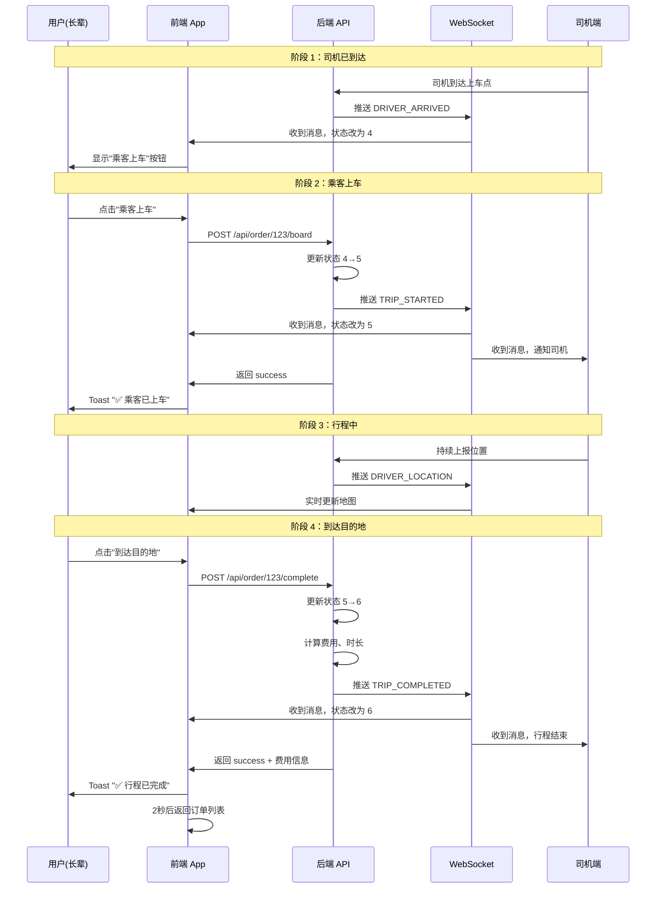
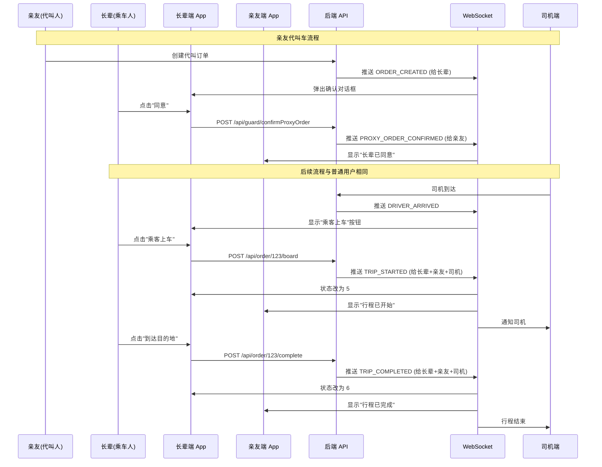

# 订单追踪功能 - 后端接口需求说明

## 📋 概述

本文档说明前端已实现的**订单追踪完整流程**功能，需要后端配合实现的接口和 WebSocket 推送逻辑。

---

## ✅ 前端已实现功能

### 1. 订单状态机（9个状态）

```kotlin
// Order.kt - 订单状态定义
0 - 待确认
1 - 已确认  
2 - 等待司机接单
3 - 司机已接单
4 - 司机已到达        ← 乘客点击"乘客上车"按钮
5 - 行程中            ← 乘客在车上，前往目的地
6 - 已完成            ← 到达目的地，行程结束
7 - 已取消
8 - 已拒绝
```

### 2. UI 交互流程

#### 阶段 1：司机已到达（状态 4）
- **UI 显示**：绿色大按钮 "乘客上车，开始行程"
- **用户操作**：点击按钮
- **调用 API**：`POST /api/order/{id}/board`
- **期望响应**：更新订单状态为 5
- **WebSocket 推送**：`TYPE_TRIP_STARTED`（通知所有相关方）

#### 阶段 2：行程中（状态 5）
- **UI 显示**：紫色大按钮 "到达目的地，结束行程"
- **地图显示**：实时显示司机位置、路线
- **用户操作**：点击按钮
- **调用 API**：`POST /api/order/{id}/complete`
- **期望响应**：更新订单状态为 6
- **WebSocket 推送**：`TYPE_TRIP_COMPLETED`（通知所有相关方）

#### 阶段 3：行程完成（状态 6）
- **UI 显示**：绿色卡片 "🎉 行程已结束，感谢您的使用！"
- **自动返回**：延迟 2 秒后返回订单列表

---

## 🔧 后端需要实现的接口

### 接口 1：乘客上车/开始行程

**请求**
```http
POST /api/order/{orderId}/board
Headers:
  X-User-Id: {userId}
  Authorization: Bearer {token}
```

**业务逻辑**
1. 验证订单是否存在
2. 验证订单当前状态是否为 `4`（司机已到达）
3. 验证操作用户是否为订单所属用户（或代叫人）
4. 更新订单状态：`4 → 5`（行程中）
5. 记录上车时间（可选）
6. **触发 WebSocket 推送**：`TYPE_TRIP_STARTED`

**响应**
```json
{
  "code": 200,
  "message": "success",
  "data": null
}
```

**错误情况**
- `404` - 订单不存在
- `403` - 无权操作此订单
- `400` - 订单状态不正确（不是"司机已到达"状态）

---

### 接口 2：到达目的地/完成行程

**请求**
```http
POST /api/order/{orderId}/complete
Headers:
  X-User-Id: {userId}
  Authorization: Bearer {token}
```

**业务逻辑**
1. 验证订单是否存在
2. 验证订单当前状态是否为 `5`（行程中）
3. 验证操作用户是否为订单所属用户（或代叫人）
4. 更新订单状态：`5 → 6`（已完成）
5. 计算实际费用（如果有计价逻辑）
6. 记录完成时间
7. **触发 WebSocket 推送**：`TYPE_TRIP_COMPLETED`

**响应**
```json
{
  "code": 200,
  "message": "success",
  "data": null
}
```

**错误情况**
- `404` - 订单不存在
- `403` - 无权操作此订单
- `400` - 订单状态不正确（不是"行程中"状态）

---

## 📡 WebSocket 推送消息格式

### 消息 1：行程开始（TRIP_STARTED）

**推送时机**：乘客点击"乘客上车"按钮，后端更新状态为 5 后

**推送对象**：
- 订单所属用户（长辈）
- 代叫人（亲友，如果有）
- 司机

**消息格式**
```json
{
  "type": "TRIP_STARTED",
  "orderId": 12345,
  "timestamp": 1776497880033,
  "message": "乘客已上车，行程开始",
  "status": 5
}
```

**字段说明**
- `type`: 固定为 `"TRIP_STARTED"`
- `orderId`: 订单 ID
- `timestamp`: 时间戳（毫秒）
- `message`: 提示消息（可选）
- `status`: 订单新状态（5）

---

### 消息 2：行程完成（TRIP_COMPLETED）

**推送时机**：乘客点击"到达目的地"按钮，后端更新状态为 6 后

**推送对象**：
- 订单所属用户（长辈）
- 代叫人（亲友，如果有）
- 司机

**消息格式**
```json
{
  "type": "TRIP_COMPLETED",
  "orderId": 12345,
  "timestamp": 1776497880033,
  "message": "行程已完成，感谢使用！",
  "status": 6,
  "actualPrice": 25.5,
  "duration": 1800,
  "distance": 5.2
}
```

**字段说明**
- `type`: 固定为 `"TRIP_COMPLETED"`
- `orderId`: 订单 ID
- `timestamp`: 时间戳（毫秒）
- `message`: 提示消息（可选）
- `status`: 订单新状态（6）
- `actualPrice`: 实际费用（可选，如果有计价）
- `duration`: 行程时长（秒，可选）
- `distance`: 行驶距离（公里，可选）

---

## 🔄 完整流程示例

### 场景：普通用户自己叫车



### 场景：亲友代叫车



---

## ⚠️ 关键注意事项

### 1. 权限验证
- `/board` 和 `/complete` 接口必须验证操作用户权限
- 允许操作的用户：
  - 订单所属用户（`userId`）
  - 代叫人（`guardianUserId`，如果存在）

### 2. 状态流转校验
- `/board`：只允许从状态 `4`（司机已到达）转移到状态 `5`（行程中）
- `/complete`：只允许从状态 `5`（行程中）转移到状态 `6`（已完成）
- 如果状态不正确，返回 `400` 错误

### 3. WebSocket 推送时机
- **必须在数据库更新成功后**才推送 WebSocket 消息
- 推送失败不应影响 API 响应（异步推送）
- 确保推送给所有相关方（用户、代叫人、司机）

### 4. 并发控制
- 防止重复点击：同一订单在短时间内多次调用 `/board` 或 `/complete`
- 建议使用分布式锁或数据库乐观锁

### 5. 数据一致性
- 更新订单状态后，立即推送 WebSocket 消息
- 消息中的 `status` 字段必须与数据库一致

---

## 📊 测试用例

### 测试用例 1：正常流程

```bash
# 1. 模拟司机到达
curl -X POST http://localhost:8080/api/order/123/driver-arrived \
  -H "X-User-Id: 19" \
  -H "Authorization: Bearer {token}"

# 预期：订单状态变为 4，WebSocket 推送 DRIVER_ARRIVED

# 2. 乘客上车
curl -X POST http://localhost:8080/api/order/123/board \
  -H "X-User-Id: 19" \
  -H "Authorization: Bearer {token}"

# 预期：
# - 订单状态变为 5
# - WebSocket 推送 TRIP_STARTED
# - 返回 {"code": 200, "message": "success"}

# 3. 到达目的地
curl -X POST http://localhost:8080/api/order/123/complete \
  -H "X-User-Id: 19" \
  -H "Authorization: Bearer {token}"

# 预期：
# - 订单状态变为 6
# - WebSocket 推送 TRIP_COMPLETED
# - 返回 {"code": 200, "message": "success", "data": {"actualPrice": 25.5}}
```

### 测试用例 2：状态错误

```bash
# 尝试在状态 3（司机已接单）时上车
curl -X POST http://localhost:8080/api/order/123/board \
  -H "X-User-Id: 19" \
  -H "Authorization: Bearer {token}"

# 预期：返回 400 错误
# {"code": 400, "message": "订单状态不正确，当前状态：司机已接单"}
```

### 测试用例 3：权限错误

```bash
# 非订单用户尝试上车
curl -X POST http://localhost:8080/api/order/123/board \
  -H "X-User-Id: 999" \
  -H "Authorization: Bearer {token}"

# 预期：返回 403 错误
# {"code": 403, "message": "无权操作此订单"}
```

---

## 🎯 优先级

| 功能 | 优先级 | 说明 |
|------|--------|------|
| `/board` 接口 | **P0** | 核心功能，必须实现 |
| `/complete` 接口 | **P0** | 核心功能，必须实现 |
| `TRIP_STARTED` 推送 | **P0** | 实时同步，必须实现 |
| `TRIP_COMPLETED` 推送 | **P0** | 实时同步，必须实现 |
| 费用计算 | P1 | 可选，如果没有计价逻辑可暂时返回 null |
| 行程时长/距离 | P1 | 可选，用于统计展示 |

---

## 📝 总结

前端已经完整实现了订单追踪的 UI 和交互逻辑，后端只需要：

1. ✅ 实现两个简单的状态更新接口（`/board` 和 `/complete`）
2. ✅ 在状态更新后推送 WebSocket 消息（`TRIP_STARTED` 和 `TRIP_COMPLETED`）
3. ✅ 做好权限验证和状态校验

**预计工作量**：2-4 小时

如有任何疑问，请随时联系前端开发团队。
